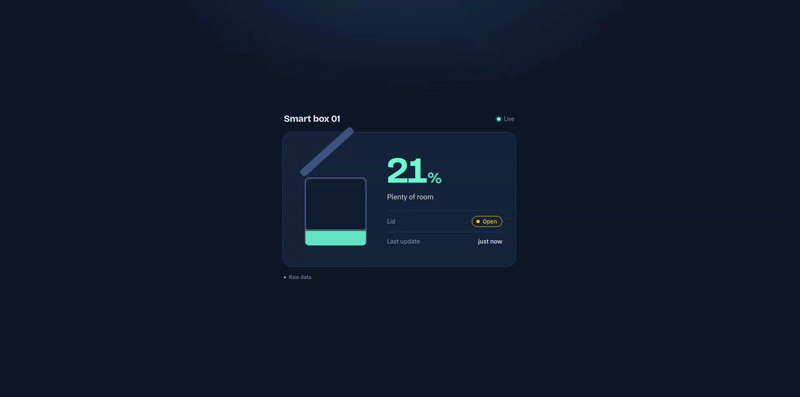
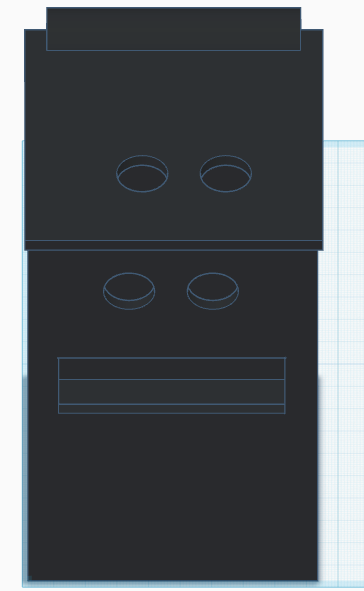

# Smart box 

## Overview
A smart box based on the ESP32 microcontroller that measures the fill level, displays it on an LCD screen and through a user interface (UI), and automatically opens its lid when someone passes in front of it without touching it.

## Tools used
| Name|Description |
| --- | --- |
|`ESP32`| We use the ESP32 microcontroller  for controlling and display of information  in UI|
| `2 Ultrasonic sensors ` | We use two ultrasonic sensors to measure the fill level of the box and detect when someone is in front of it |
| `LCD screen` | We use an LCD screen to display the fill level and other information |
| `Servo motor` | We use a servo motor to open and close the lid of the box automatically |


## Server (`serv.py`)

A Flask server that receives sensor data from an ESP over HTTP and forwards it to the web page in real time using Socket.IO.



## How It Works
 
```
ESP device  --POST JSON-->  Flask server  --Socket.IO-->  Web browser
            /api/sensor      (serv.py)     "sensor_update"   (index.html)
```
 
1. The ESP sends sensor readings as JSON to `/api/sensor`.
2. The server send the JSON to the UI to vizuilize it.


### Run

```bash
pip install flask flask-socketio
python serv.py
```
##3D Design





The server runs on port `5000`.

